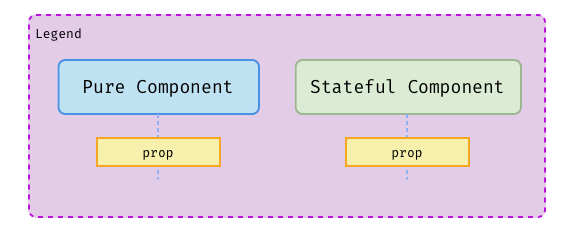
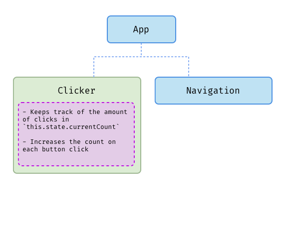
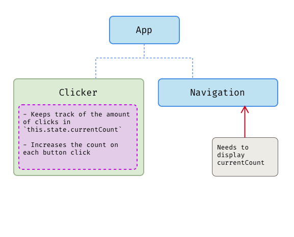
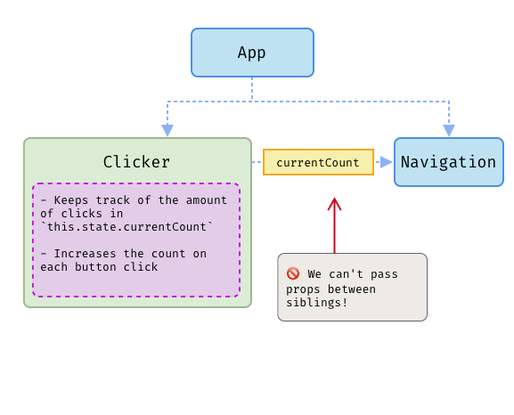
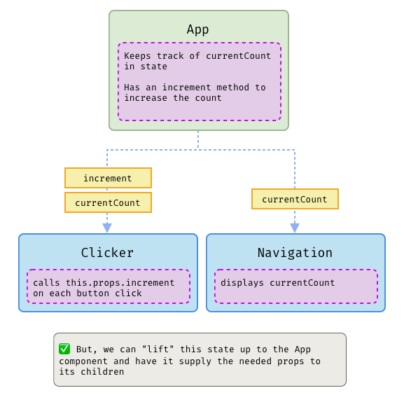

# State & Architecture

In this lesson, we are going to:

- Review unidirectional data flow
- Talk about "pure" vs "stateful" components
- Learn how to "lift" state up the component tree.
- Discuss how State fits into the overall architecture of your apps

## Review:

- Passing data in react is _unidirectional_: data is passed as props from parents to siblings. Siblings cannot pass anything back up!
- A "pure" (sometimes refered to as "dumb") component is one that does not manage any state. Given the same props, it will always render the same result.
- A "smart" or "stateful" component is one that manages its own state. This can be a Class component, or a Function component that uses hooks. We will cover hooks in a later lesson.

## Lifting State

So far, our stateful components have been pretty "shallow" - they don't have a lot of children props, and the logic for updating the state has all happened in the same component. But, as your apps begin to grow, you'll find the need to handle state changes through interactions that occur further down the tree.

A big part of React is figuring out where to keep track of your state. Our components render in a "tree", with the parent components passing information down to their children. State is usually handled as "locally" as possible: meaning that the component that relies on changes to that state is usually the one that contains all of the logic for updating it. But, at times you will find that you need to start sharing this state with components in other parts of the tree. Since we can't pass props between siblings, we can "lift" the state up.

### Some Pictures

Here's a diagram of a simple Clicker app. The main App component renders a `<Clicker />` and a `<Navigation />` component.

But, the needs of the project have grown - we now need the Navigation component to render the current count:

Currently, the Clicker is keeping track of the currentCount in its own state. But, we can't pass this over to the Navigation component.

🤔What can we change to get the current count to display in the Navigation?

  
Solution

  To do this, we can "lift" our `currentCount` state up to the App component. This way, we can supply the `currentCount` to both child components. To update the count, We can pass our `increment` function down to the Clicker as a prop!

### Demo

🔗 [Codesandbox Demo (initial)](https://codesandbox.io/s/clever-satoshi-ziuzv)
🔗 [Codesandbox Demo (refactored)](https://codesandbox.io/s/cranky-pare-l8h1g)

### 🏋️‍Exercise

See the [Exercise Readme](./exercise.md) for instructions!
